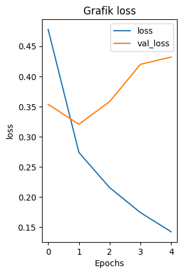
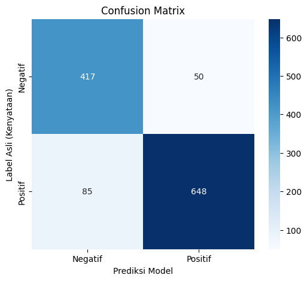

# analisis-sentimen-instagram-lstm
# Analisis Sentimen Ulasan Aplikasi Instagram Menggunakan Deep Learning (LSTM)

# ANGGOTA KELOMPOK
1. ARIP
2. CAROL DP
3. ARYA PANGESTU
4. RAFDY FAUZAN

Repositori ini berisi dokumentasi proyek analisis sentimen terhadap ulasan pengguna aplikasi Instagram di Google Play Store. Proyek ini bertujuan untuk mengklasifikasikan ulasan menjadi sentimen **Positif** atau **Negatif** menggunakan metode Deep Learning.

## 📌 Ringkasan Proyek
- **Dataset**: Ulasan aplikasi dari Google Play Store.
- **Metode**: Long Short-Term Memory (LSTM) Bidirectional.
- **Teknik Optimasi**: Early Stopping & Class Weighting (untuk menangani data tidak seimbang).
- **Akurasi Model**: 88.75%.

## 📂 Struktur File
1. **1_scraping_data.ipynb**: Notebook untuk mengambil data ulasan menggunakan library `google-play-scraper`.
2. **2_Training_Model.ipynb**: Notebook utama untuk preprocessing teks, pembangunan model, dan evaluasi.
3. **dataset_sentimen.csv**: Data mentah hasil scraping.

## 🛠️ Tahapan Pengerjaan

### 1. Scraping Data
Data diambil langsung dari Google Play Store dengan filter ulasan terbaru. Atribut yang diambil meliputi username, rating, tanggal, dan teks ulasan.

### 2. Preprocessing
Tahapan pembersihan data meliputi:
- Case folding (mengubah huruf menjadi kecil).
- Tokenisasi & Padding sequences.
- Pembagian data latih (80%) dan data uji (20%).

### 3. Pemodelan (Arsitektur LSTM)
Model dibangun menggunakan TensorFlow/Keras dengan arsitektur:
- **Embedding Layer**: Representasi vektor kata.
- **Bidirectional LSTM**: Mempelajari konteks kalimat dari dua arah (depan & belakang).
- **Dropout (0.5)**: Mencegah overfitting.
- **Dense Layer (Sigmoid)**: Output biner (0 untuk Negatif, 1 untuk Positif).

### 4. Penanganan Overfitting & Imbalance
Untuk memastikan model valid:
- **Class Weights**: Memberikan bobot lebih besar pada kelas minoritas agar model tidak bias.
- **Early Stopping**: Menghentikan pelatihan otomatis jika validasi loss tidak membaik (berhenti di Epoch terbaik) untuk mencegah overfitting.

## 📊 Hasil Evaluasi

Berdasarkan pengujian pada data test, model mencapai performa berikut:

| Metric | Score |
| :--- | :--- |
| **Akurasi** | **88.75%** |
| Recall (Negatif) | 89% |
| Recall (Positif) | 88% |

**Grafik Akurasi & Loss:**

**Confusion Matrix:**

## 🔍 Contoh Prediksi
Model berhasil memprediksi kalimat dengan konteks yang sulit:

1. *"Aplikasinya sangat membantu, fiturnya lengkap."* -> **Positif**
2. *"Loadingnya lama sekali, sering force close."* -> **Negatif**
3. *"Biasa saja, standar seperti aplikasi lain."* -> **Negatif**

## 💻 Tech Stack
- Python
- TensorFlow / Keras
- Pandas & NumPy
- Scikit-learn
- Google Play Scraper

---
*Dibuat untuk memenuhi Tugas Mata Kuliah Deep Learning / Teknik Informatika.*
